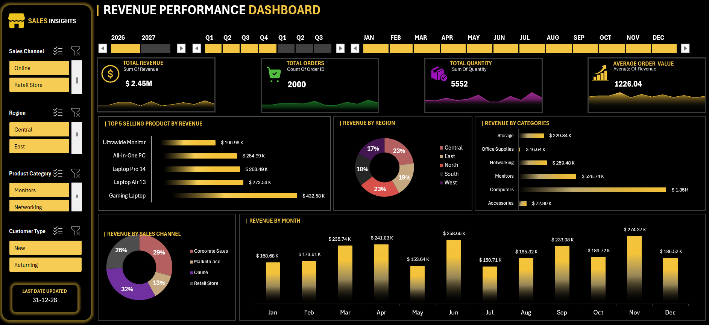

# 📊 Revenue Performance Dashboard

An interactive **Revenue Performance Dashboard** built using Microsoft Excel to analyze revenue, orders, quantity, products, regions, categories, and sales channels.

## 📌 Dashboard Preview

## 🚀 Key Features

* 💰 Total Revenue
* 🛒 Total Orders
* 📦 Total Quantity
* 📈 Average Order Value
* 📅 Interactive Timeline
* 🗓️ Year, Quarter & Month Analysis
* 🌍 Revenue by Region
* 🏷️ Revenue by Category
* 🛍️ Revenue by Sales Channel
* ⭐ Top 5 Selling Products
* 📊 Monthly Revenue Trends
* 🎛️ Interactive Slicers

## 🛠️ Tools & Technologies

* Microsoft Excel
* Pivot Tables
* Pivot Charts
* Slicers
* Timeline
* KPI Cards
* Data Visualization
* Dashboard Design

## 🎯 Objective

The objective of this project was to transform raw sales data into an interactive and visually appealing dashboard that helps users quickly understand revenue performance and identify important business trends.

## 📊 Dashboard Insights

The dashboard provides multiple perspectives of sales performance through:

**Revenue Analysis**
Track total revenue and monthly revenue trends.

**Product Analysis**
Identify the top-selling products by revenue.

**Regional Analysis**
Compare revenue performance across different regions.

**Category Analysis**
Understand which product categories contribute the most revenue.

**Sales Channel Analysis**
Compare performance across different sales channels.

**Time Analysis**
Use the interactive timeline to analyze performance by **Year, Quarter, and Month**.

## 📁 Project Files

| File                                 | Description                 |
| ------------------------------------ | --------------------------- |
| `Revenue_Dashboard.xlsx` | Interactive Excel dashboard |
| `Dashboard_Preview.png`              | Dashboard preview           |
| `README.md`                          | Project documentation       |

## 💡 Skills Demonstrated

* Data Analysis
* Data Visualization
* Dashboard Development
* Excel Reporting
* Business Intelligence
* Interactive Reporting
* KPI Design

---

### 👨‍💻 Project

Created as part of my journey in **Data Analytics & Business Intelligence**.

If you found this project useful, feel free to ⭐ the repository.

